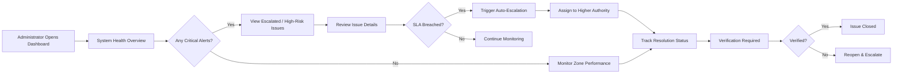
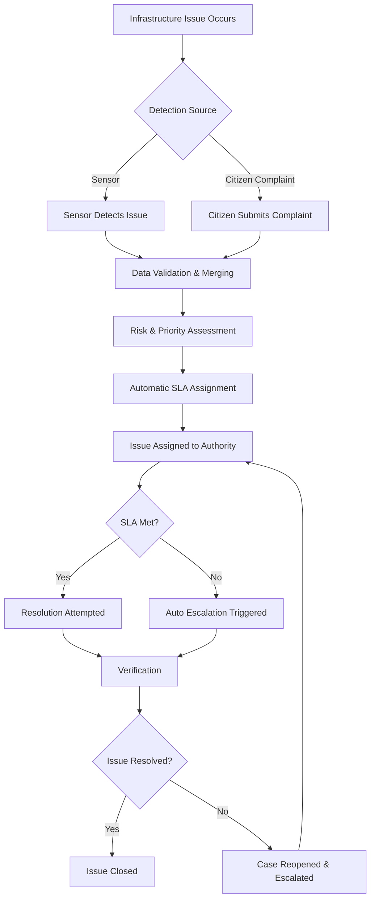

# CITY GRID MONITOR 
**From Complaint-Driven Governance to Self-Aware Cities**

##  PROBLEM STATEMENT

Urban governance in Indian cities is still largely dependent on citizen complaint platforms
to identify and resolve civic infrastructure issues such as non-functional streetlights,
overflowing garbage bins, and unhygienic public toilets.

Despite the presence of multiple applications and portals, the same problems continue
to reoccur. The core issue is not the lack of complaints, but the lack of system-level
awareness, objective verification, and enforceable accountability.

Existing systems are:
- Reactive, acting only after complaints are raised
- Manual and delayed in execution
- Subjective, relying heavily on photo-based validation
- Weak in resolution verification
- Inconsistent in enforcing accountability

As a result, governance remains complaint-heavy but system-blind.

---

## 🎯 OUR APPROACH

City Grid Monitor introduces a system-centric governance approach that treats complaints
as signals rather than absolute truth.

The platform acts as an intelligence and enforcement layer that enables cities to:
- Detect infrastructure issues automatically
- Validate complaints using data
- Prioritize issues based on risk and urgency
- Enforce time-bound action through SLAs
- Verify resolution objectively before closure

> **Complaint + Data + Rules = Enforced Action**

---

## 🏗️ SYSTEM WORKFLOW

City Grid Monitor is designed as an administrative command dashboard for city authorities.
It provides real-time visibility into infrastructure health, unresolved issues, and
accountability across departments.

The system focuses on critical public services such as:
- Street lighting
- Solid waste management
- Public sanitation infrastructure

Rather than replacing existing government platforms, the system is designed to
upgrade them by adding intelligence, verification, and enforcement.

---

## 🖥️ DASHBOARD OVERVIEW

The dashboard provides a consolidated, real-time view of the city’s operational health.
It enables administrators to quickly identify risk zones, delayed actions, and
responsibility ownership without manually reviewing individual complaints.

The dashboard is structured to support both:
- Strategic oversight
- Day-to-day administrative action

---

## 📊 KEY DASHBOARD COMPONENTS

### System Health Indicators
- **System Status:** Indicates whether monitoring and data pipelines are operational
- **Assets Online:** Shows the number of infrastructure assets connected to the system
- **Active Issues:** Displays unresolved infrastructure issues
- **SLA Breaches:** Highlights issues exceeding resolution timelines

---

### Quick Action Panel
Provides direct access to critical workflows:
- Active issues under resolution
- Escalated cases requiring immediate attention
- Issues pending verification
- SLA breach alerts

This separation ensures faster transition from awareness to action.

---

### Zone Risk Overview
The city is divided into zones based on issue severity and resolution performance:
- **Critical Zones:** Multiple unresolved or high-severity issues
- **At-Risk Zones:** Issues trending toward SLA breach
- **Stable Zones:** Minimal issues and timely resolutions

This allows proactive resource allocation and targeted intervention.

---

### Active Enforcement Cases
This section functions as an enforcement register rather than a simple issue list.

Each case clearly displays:
- Affected public asset
- Jurisdiction and risk level
- Responsible authority
- Time since issue reporting
- Current resolution or verification status

This design ensures that responsibility and delay remain visible.

---

## ⏱️ Escalation & Accountability Logic

City Grid Monitor follows a rule-based escalation mechanism:
- Issues are assigned to the relevant authority upon validation
- SLAs are automatically applied based on issue category
- If an SLA is missed, the system escalates the issue to higher authorities
- Issues are closed only after verification confirms resolution

## 🧭 Dashboard Decision Flow

This prevents negligence, delays, and false closures.

---

## 🔄 END-TO-END WORKFLOW

**This workflow ensures that no issue is resolved without objective confirmation
and that accountability is enforced systematically.**

🌐 **LIVE DEMO**

🔗 Live Dashboard:
https://city-grid-monitor.lovable.app

The current version demonstrates system behavior using simulated data
to reflect real-world workflows and escalation logic.

---

##🔮**ROUND-2 IMPLEMENTATION PLAN**

In Round-2, the project will move beyond conceptual demonstration
towards validating real-world feasibility of the proposed system.

The focus of Round-2 will be on depth rather than expansion, including:

- Integration of a lightweight backend to simulate live issue creation,
  SLA timers, and escalation transitions
- Demonstration of one real infrastructure asset using a low-cost sensor
  (e.g., garbage bin fill level or streetlight status)
- Live visualization of escalation when SLA thresholds are crossed
- Verification logic to prevent issue closure without objective confirmation
- End-to-end demo from detection to enforcement on the live dashboard

The goal of Round-2 is to prove that the proposed governance workflows
can operate reliably with real signals and enforced accountability.

---

##🧪 **Round-1 Scope:**

For Round-1, the project focuses on demonstrating system thinking,
governance workflows, and feasibility through a functional prototype.

*The scope of this round includes:*
- A live administrative dashboard representing city system health
- Simulated data to demonstrate issue creation, SLA tracking, and escalation
- End-to-end workflow visualization from detection to resolution
- Clear articulation of escalation and verification logic
- Architecture and diagrams explaining system behavior

The emphasis in Round-1 is on clarity, originality, and feasibility,
rather than full-scale deployment.

---

##🏆 **CONCLUSION**
City Grid Monitor transforms civic governance from reactive complaint handling
to proactive, system-aware, and accountable administration.

By making risk, delay, and responsibility visible, the platform enables
faster intervention, better resource utilization, and increased public trust.

---

##👥 **TEAM INFORMATION**

*Team Name:* Human Error 404

*Hackathon:* Hack The Winter – The Second Wave

*Theme:* Governance

**Team Members**

Yashashvi Jadoan

Harshit Thakur (Team Leader)

Priyanshu Singh

Anvesha Bharadwaj
